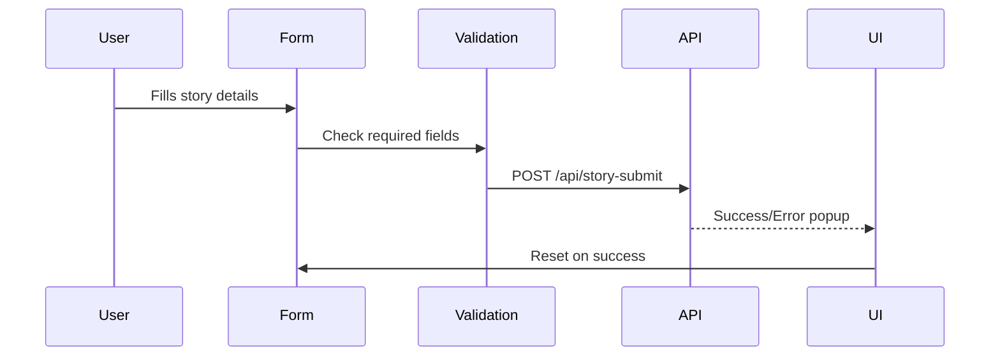
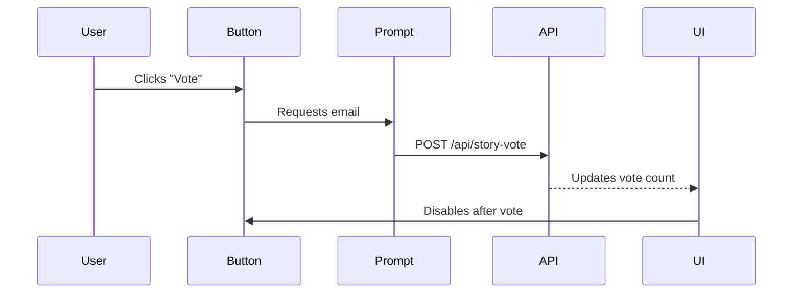
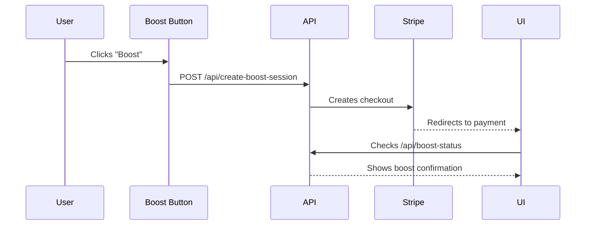

# candidate-Farooq-tennislore-module-A-B-C-combined-
TennisLore is a web application designed for tennis enthusiasts to share their unforgettable match-point tales and court-side memories. The platform allows users to submit their stories, vote on their favorite tales, and boost stories for extra visibility within the community.

# Live Page: https://tennislore.netlify.app/
# TennisLore - Court Stories 🎾

A community-driven platform where tennis fans share match-point tales, powered by public submissions, voting, and story boosts.

## ✨ Features

### Module A: Story Submission
- 📝 Form with client-side validation
- ✅ Success: "✅ Story submitted!" 
- ❌ Error: "❌ Please try again."
- 📬 POST `/api/story-submit` simulation

### Module B: Community Voting
- 👍 "Vote for This Tale" button
- 🗳️ Email verification
- 🔢 GET `/api/story/{id}/votes` simulation
- ⛔ Disables after voting

### Module C: Paid Boost
- ⚡ $2 boost with 20% platform fee
- 💳 POST `/api/create-boost-session` simulation
- 📈 GET `/api/boost-status` checker
- 🔄 Loading states

## 🏗️ Architecture

### Module A: Story Submission Flow

### Module B: Voting Mechanism

### Module C: Boost Payment Flow

### 🛠️ Tech Stack
- Frontend: HTML5, CSS3, JavaScript (ES6+)
- Icons: Font Awesome 6
- Fonts: Google Fonts (Montserrat, Lato)
- Design: Mobile-first responsive layout
### 🎨 Brand Guidelines
- Colors:
      Primary: #43A047 (Green)
      Accent: #FFFFFF (White)
      Neutrals: Slate gray
- Typography:
      Headlines: Montserrat Bold
      Body: Lato Regular
- UI Elements:
    Net-style borders
    Hover lifts on cards
### 📸 Output Preview:
Screenshots of all cases are available in the Images folder
### 📬 For any details Contact:
 Syed Umar Farooq - syedumarfarooq2782@gmail.com
 🔗 GitHub: https://github.com/SyedFarooq2782
